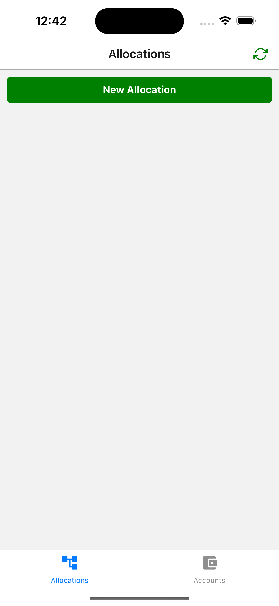
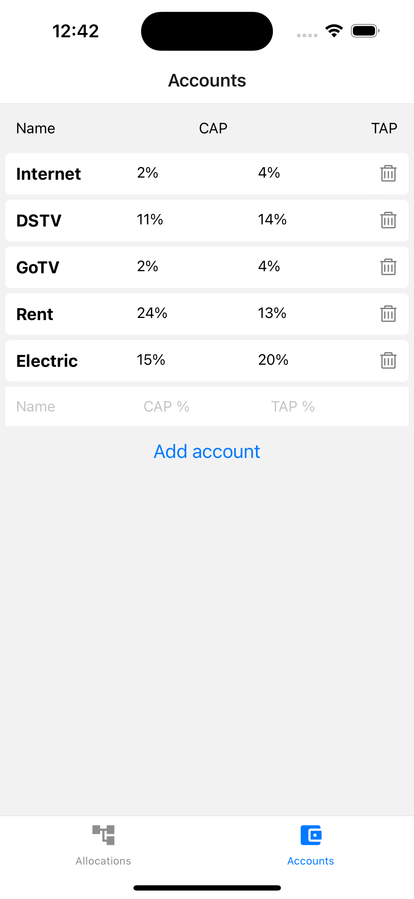
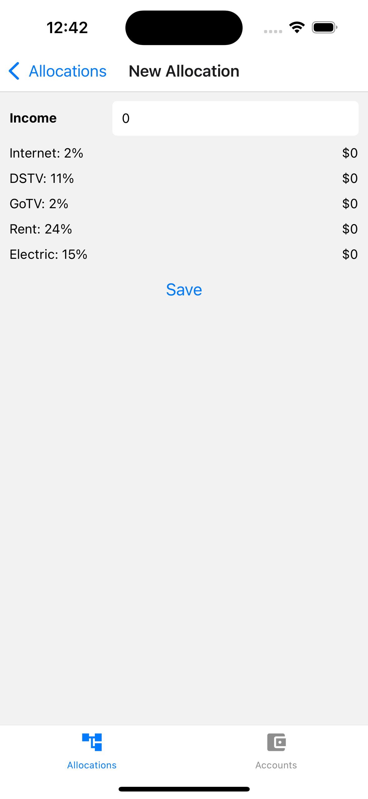
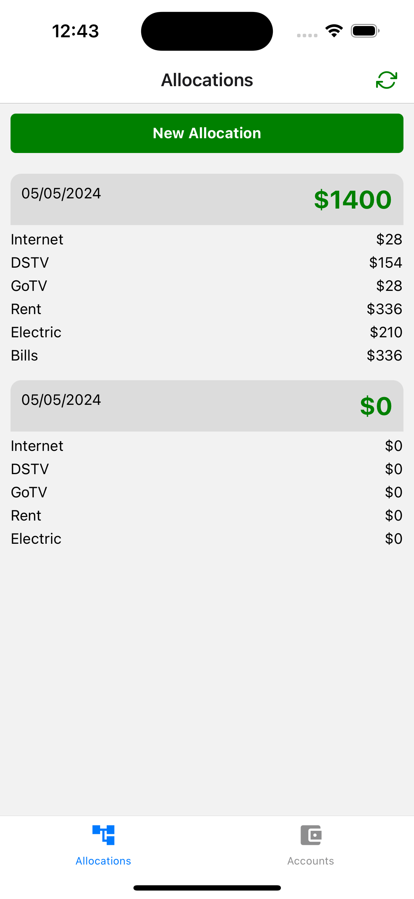

# Profile First Finance App

Welcome to the Profile First Finance App! This mobile application helps users manage their finances with a focus on personal profiles. It utilizes React Native, Expo, Watermelon DB, Supabase, Expo Crypto, and other libraries to provide a seamless and secure financial management experience.

## Features

- **Profile Management**: Users can create and manage multiple financial profiles, each with its own set of transactions, budgets, and settings.
- **Transaction Tracking**: Record income, expenses, and transfers with customizable categories and tags for better organization.
- **Budgeting**: Set up monthly budgets for different expense categories to track spending habits and manage finances effectively.
- **Secure Authentication**: Utilizes Supabase for user authentication and data storage, ensuring data security and privacy.
- **Offline Support**: Watermelon DB enables offline-first functionality, allowing users to access and modify their financial data even without an internet connection.
- **Encryption**: Expo Crypto is used to encrypt sensitive user data, such as account credentials and transaction details, for enhanced security.

## Installation

1. Clone the repository:

```bash
git clone https://github.com/abazudosen/ProfitFinance


2. Configuration

- SUPABASE_URL=your_supabase_url
- SUPABASE_ANON_KEY=your_supabase_anon_key


2. Dependencies:

- [Expo Router](https://docs.expo.dev/routing/introduction/) file-based navigation and API Routes

- [Supabase](https://supabase.com) an open-source alternative to Firebase. It provides a set of tools and services for building real-time applications with PostgreSQL. Supabase offers features like authentication, real-time database, and file storage, all accessible through a simple API.

- [Watermelon DB](https://watermelondb.dev/docs/Installation) Watermelon DB is a reactive database for React and React Native applications. It is built on top of SQLite and provides an easy-to-use, schema-based API for managing application data. Watermelon DB is designed for offline-first applications and offers features like automatic syncing and conflict resolution.

- [Expo Crypto](https://docs.expo.dev/versions/latest/sdk/crypto/)  a module in the Expo SDK that provides cryptographic functions for React Native applications. It allows developers to perform cryptographic operations like hashing, encryption, and decryption using native code.

3. Screenshots

<div style="display: flex; flex-direction: 'row';">




</div>
```
